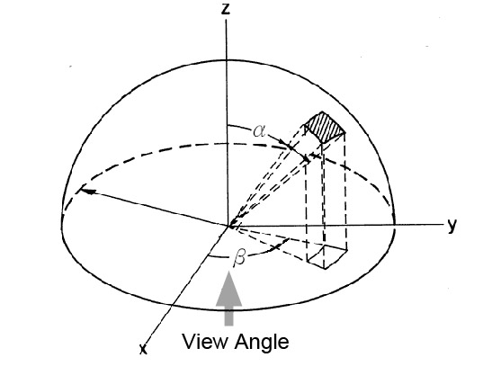
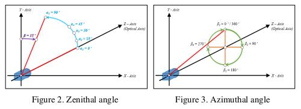
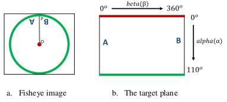

Definition and overview
#######################

What is the MOIL app?
================

.. raw:: html

   

    

        MoilApp is an image processing program created by <b> MOIL-LAB</b>, a laboratory specialising in omnidirectional imaging and surveillance. The program utilises the <b>Moildev SDK</b>, a technique for processing Fisheye Images. This SDK is most commonly used for creating <b>Panorama Views</b> and <b>Anypoint View</b>, as it enables the processing of Fisheye Images, which are known for their high image quality and wide-angle FoV (Field of View). This feature makes it ideal for various applications, such as surveillance systems, computer vision, etc.
    

   
With its sophisticated image processing technology, MoilApp has become the choice for users who require high-quality images and a wide-angle field of view. The program's ability to process Fisheye images provides several benefits, such as the ability to stitch together panoramic views. Furthermore, its advanced image processing capabilities make it ideal for use in various fields. Overall, the Moildev SDK and MoilApp are excellent tools for anyone looking to process Fisheye images and take their image processing capabilities to the next level.
   

What is Fisheye Lens Technology?
========================
.. raw:: html

   

   

    The Fisheye lens, also known as the <b>Fisheye Image Sensor (FIS)</b>, is a unique ultra-wide-angle lens with a short
    focal length that generates considerable optical distortion.
    It is designed to provide a wide, panoramic, or hemispherical image.
    The large field of view is the most important characteristic; with a FOV of more than 180 degrees, 	a Fisheye camera (also known as a Fisheye Image Sensor, or FIS) can capture a clear image, but with a greater barrel distortion.

    According to <b>Professor Chuang-Jan Chang</b>, the approach to displaying Fisheye camera images incorporates multi collimator metrology
    and cartography in order to methodically characterise the Fisheye camera's projection mechanism.
    The hemisphere coordinate system is produced by the Fisheye camera in our suggested technique.
    Hence, the position of an image point referring to the principal point on the image plane directly reflects its corresponding
 	zenithal distance (α) and azimuthal distance (β) of the sight ray in space, in order to normalise the imaged point onto a small sphere presented in the following figure.

    

.. raw:: html

   

    

    Based on the coordinate system, the angles respectively defined by the incident rays and the optical axis are the
    <b><i>zenithal angle (α)</i></b> and the<b><i> azimuthal angle (β)</i></b>, which surround the optical axis.
    They have a relationship with the coordinate system X, Y, and Z, where the optical axis is defined by the Z-axis.
    The  <b><i>zenithal angle</i></b> is the angle from the vertical optical axis to the X- and Y-axes, as shown in
    Figure 2. The  <b><i>azimuthal angle</i></b> is defined as the angle of the positive Y axis as the reference point, with a value of 0°,
    and the Z-axis as the rotation axis, as shown in Figure 3. The rotation around the optical axis is the angle of the Y axis, starting from the positive direction and rotating clockwise around the X-axis.
    

What is Anypoint View?
======================

.. raw:: html

   

   

    This method adjusts the optical axis to the specified <b><i>zenithal (alpha)
    </i></b>and <b><i>azimuthal (beta)</i></b> angles depending on the coordinates
    provided, changing the picture plane coordinates to hemispherical coordinates.
    The Anypoint view is an image that has been undistorted in a certain area according to the input coordinates.
   

What is Panorama View?
======================

.. raw:: html

   

  

    To accommodate ordinary human visual perception, the panoramic view may offer a horizontal perspective within a
    particular, immersed environment. Figures A and B demonstrate the Fisheye image model and the mapping plane of the panoramic view, respectively.
    The longitude and latitude of spherical coordinates are the target plane's horizontal and vertical axes, respectively.
    The maximum radius of longitude (also known as beta) and the latitude (commonly known as alpha) are each half of the camera's field of view (FoV),
    which in this study is 220 degrees.
    The Fisheye image can be expanded by setting the alpha and beta values to 0
    and using the method's formula to calculate.
  

What is the purpose of this app?
=============================

.. raw:: html

   

    

    Fisheye camera technology is widely used in various industries, such as 3D measurement, medicine, ADAS(Advanced driver-assistance systems), and many more.
    With their ability to capture a wide-angle field of view, fisheye cameras provide high-quality images and data that are essential in various applications.
    The technology has become increasingly prevalent, offering a cost-effective solution for capturing large areas without the need for multiple cameras.
    In 3D measurement, fisheye cameras capture data with high accuracy, while in medicine they are used for endoscopy procedures.
    In ADAS systems, fisheye cameras provide a 360-degree view of the vehicle, enhancing safety and driver assistance features.
    With the increasing demand for high-quality imaging and data in various industries, the use of fisheye camera technology is expected to continue to grow in the future.
    

