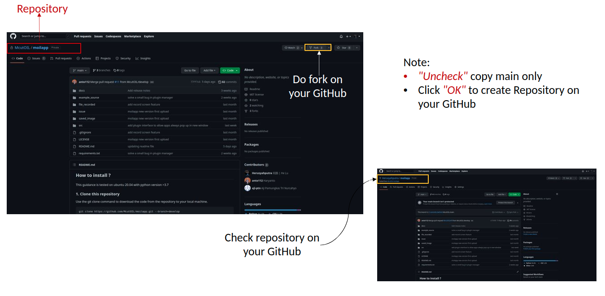
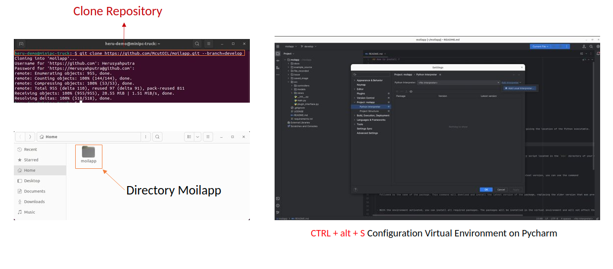
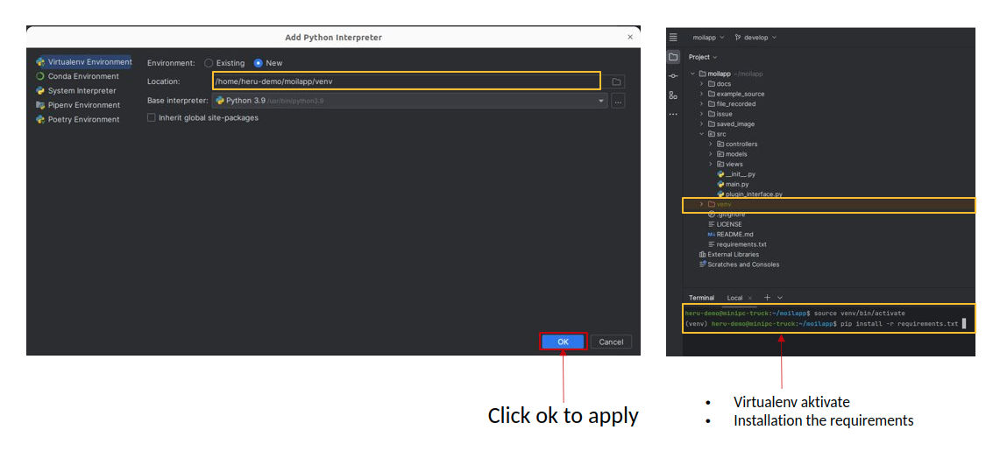

How to Contribute.
#################

.. raw:: html

    

    These instructions serve as a guide for contributing to the MoilApp repository with a
    personal repository project. The process includes forking the MoilApp repository,
    modifying the project code, and submitting a pull request to merge the changes.
    It is essential to keep in mind that the guidelines and instructions may differ depending on MoilApp specific requirements and guidelines.
    

GitHub Operations
================

Forking a Repository
------------------

.. raw:: html

   

    To share a GitHub repository, first note its name and go to its page on GitHub. Then, click the <b>Fork</b> button in the upper
    right corner to make a copy on your own account. Be sure to select <b>"Copy Main Only"</b> in the confirmation windows to avoid
    affecting the original repository and its other branches with changes or updates.

   Fork the Repository

Cloning a Repository
----------------

.. raw:: html

   

    It is recommended for the user to create a new branch under the <b>Develop</b> branch of the MoilApp repository after cloning, in order to prevent conflicts between their changes and updates made to the original repository. This is crucial, as it enables the user to work on their modifications separately, without impacting the primary codebase.

   Clone the Repository

Creating the Virtual Environment
--------------------------------

.. raw:: html

   

    Once you have finished cloning the repository, you can open the project folder using PyCharm and create a virtual environment configuration by pressing <b>Ctrl + Alt + S</b>. This step is necessary before installing the required library. It is important to carefully follow each step in order to create a local environment for your project, ensuring that the application runs properly as required.

   Setting the virtual environment and installation requirements

.. raw:: html

   

    By adhering to these instructions, you can guarantee that the application operates as planned and that there are no inconsistencies between its requirements and other projects' dependencies on your system. Establishing a virtual environment for each project is a recommended approach that can assist you in more efficiently managing dependencies and ensuring that your projects are kept separate from one another.

Do Pull Request your Project
--------------------------

.. raw:: html

   

    After pushing your modifications to the remote repository, you can initiate a pull request, asking the manager to examine
    and merge the changes into the main branch. To create a <b>pull request</b>, carry out the following steps:

    Navigate to the repository on GitHub where you pushed your branch.

 - *Click on the "Pull Request" tab.*

 - *Click on the "New pull request" button.*

.. raw:: html

   

    To merge your changes into the main branch, choose the branch you wish to merge, examine the modifications you have made,
    and provide a relevant feedback or explanations for your colleagues. Once its done, hit the <b>"Create pull request"</b> options.

Making a Contribution to the Project
================================

.. raw:: html

   

   Once you have completed the application process, you can begin making contributions to the project, such as submitting bug reports, fixing issues, or contributing code. Contributing to an open-source project, collaborating with others, and giving back to the community is a rewarding experience.

