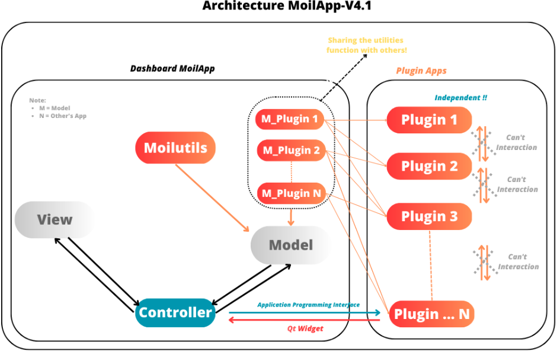
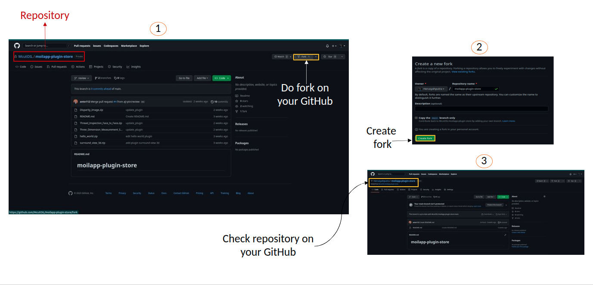
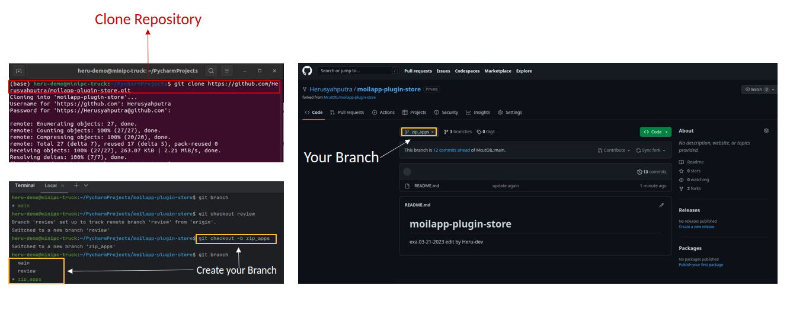
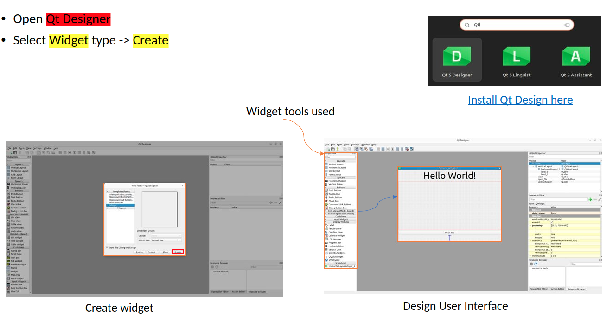
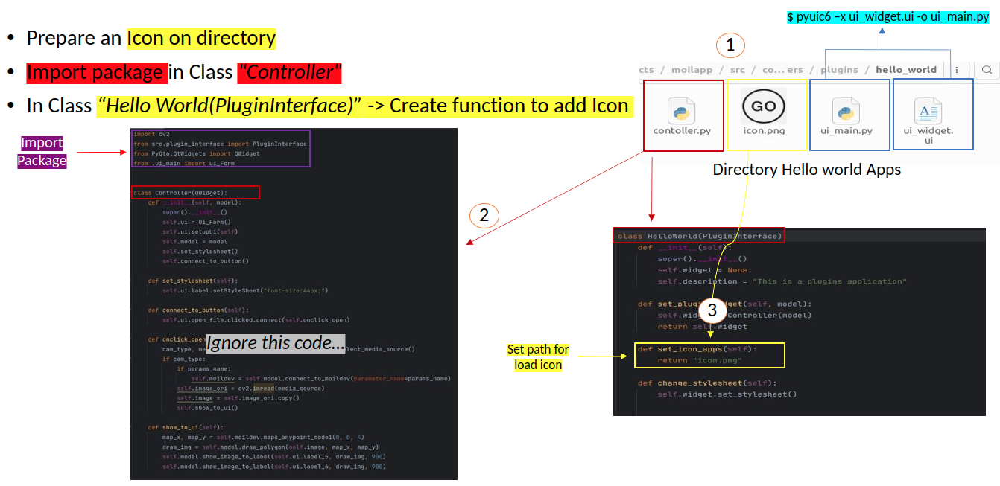
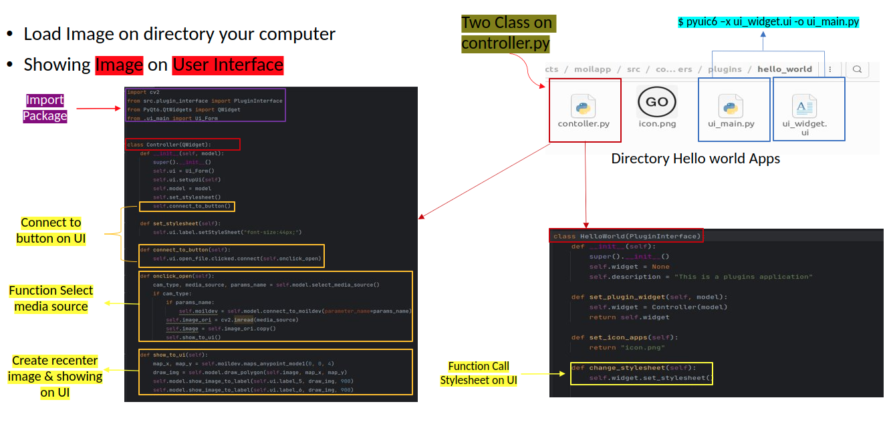
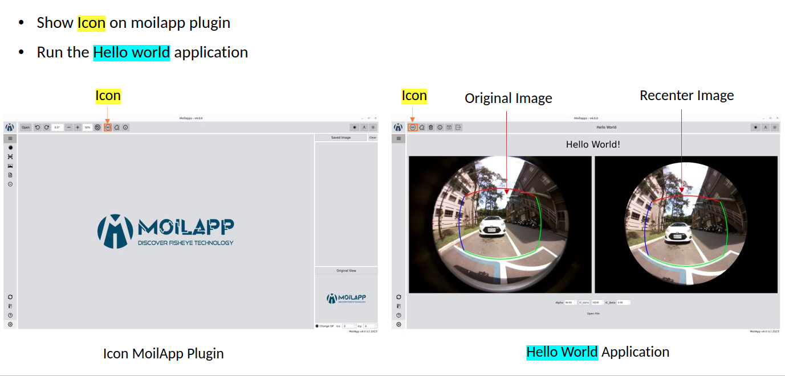
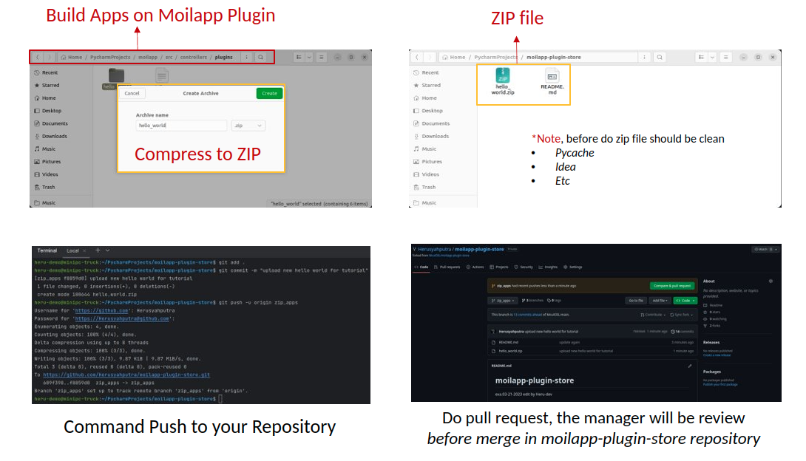

Plugin Extention
################

Introduction
============

.. raw:: html

   

    MoilApp V4.0 is an application with an <b>MVC</b> (Model-View-Controller) architecture design. However, in the current MoilApp V4.1 version, MoilApp has implemented a slightly different MVC model using the Plugin model type. This new model can be used to control other application plugins. For instance, Plugin Model 1 can control Plugins 1, 2, and 3, whereas Plugin Model 2 can only control Plugins 2, 3, and N. Similarly, Plugin Model N can only control Plugins 3 and N. This implementation was done because the plugin concept is independent, and each plugin can have its own specific requirements or models. However, the MoilApp dashboard can still control multiple plugins based on the requirements or models used for a particular application plugin. In this way, MoilApp can provide better flexibility and control to the user while maintaining the overall architecture design. To summarize, MoilApp V4.1 now utilizes a Plugin model type, which allows for better control and flexibility over the various application plugins, while still preserving the overall MVC architecture design.

   Design the MoilApp plugin architecture

Prerequisites
==============

Before proceeding with this guide, make sure that:

    - *You have a basic understanding of Python and PyQt.*
    - *You have installed the Qt Designer tool.*
    - *You have installed the PyQt5 library.*
    - *You have cloned the MoilApp repository from GitHub.*

Action Plugin
==============

.. raw:: html

   

    The MoilApp program includes a plugin notion that is integrated into its design, featuring a menu bar and a button.
    Containers that are dedicated to managing the plugin application. The interface is depicted in the following illustration:

.. raw:: html

   

    - <i>Adding a plugin app</i> 

      To include your own plugin application, access the app's folder from the controller in the plugin and add your app.
      If your app adheres to the specified format and is successfully added, it will be accessible through the plugin and can be executed.

.. raw:: html

   

   - <i>Installing the app</i> 

     You can use the plugin store icon to install the provided application.<//p>

.. raw:: html

   

   - <i>Opening the plugin application</i> 

     You can open the plugin you have installed by selecting it in the combo box and clicking the Open Plugins button.

.. raw:: html

   

   - <i>Deleting a plugin app</i> 

     To remove a plugin application from the MoilApp program, you need to access the plugin controller container and
     Click on the <b><i>"Delete"</i></b> button. This action will prompt a confirmation dialog to ensure that you want to proceed with
     the deletion.  If you confirm the deletion, the plugin application will be removed from the list of available applications in the combo box.

GitHub Operation
=================

.. raw:: html

    

    To publish the new application from the local branch to the repository group, the user must first create a fork on their
    own <b><i>GitHub account</i></b>. After that, they can use the MoilApp plugin to create a new application.

Do Fork Repository
-------------------

.. raw:: html

   

    Making a note of the name of the repository you wish to share on your GitHub account is the first step.
    You can click the <b>"Fork"</b> button in the top right corner of the screen once you have arrived at the repository's
    GitHub page.  The repository will be duplicated in your personal GitHub account as a result. 

    To make sure that just the main branch of the repository is cloned, it is crucial to select <b>"Copy Main Only."</b>
    option when creating the fork. The confirmation window that opens when you click the <b>"Fork"</b> button typically has
    this option.  You may be sure that any alterations or updates you make to the repository will take effect by simply
    duplicating the <i>main branch.</i>

   Fork the repository

Do Create New Branch
--------------------

.. raw:: html

   

    To avoid conflicts between your changes and the updates made to the original MoilApp repository, it is recommended that
    You create a new branch under the <b>"develop"</b> branch after cloning the MoilApp repository. This way, you can work on your
    changes in isolation without affecting the original codebase or interfering with updates to the develop branch in the original repository.

   Create new branch on your branch

Create Plugin Application
=========================

.. raw:: html

   

    To build an application with an <b>API</b>, you need to create a program that can interact with the API to exchange data and
    perform functions.  <b>APIs</b> provide protocols and tools that enable different software applications to communicate with each other.

Design User Interface
---------------------

.. raw:: html

   

    To develop an application, you start by designing the user interface using Qt Designer. If you don't have this tool,
    installed on your computer, install it first. Once you have designed the interface, you need to convert the <b>*.ui</b>
    file to a <b>*.py</b> file, which can be done as follows:

   Create User Interface

Plugin Interface (API)
-----------------------

.. raw:: html

   

    A plugin interface is an <b>API</b> that connects the main application with the plugin widget. It allows you to create custom
    user interfaces and use models from the main application without starting from scratch.

.. figure:: assets/3.api.png
   :scale: 65 %
   :alt: Plugin Interface
   :align: center

   Plugin Interface (API)

.. raw:: html

   

    The purpose of this class is to define an interface that can be implemented by plugins in various applications.
    By default, the <i>description</i> attribute of the object's init method is set to <i>UNKNOWN.</i>

    These are the methods that concrete subclasses of the <b>Plugin</b> class:

- **Set_plugin_widget:** This method should establish a plugin widget based on a *Model* object that is passed in as input.

- **Set_icon_apps:** This method should determine the plugin application's icon.

- **Change_stylesheet:** This method should modify the plugin applications's CSS.

.. raw:: html

   

    By default, the <b>always_pop_up</b> method of the <b>Plugin</b> class returns the boolean value <b>False</b>, meaning that the plugin does not always pop up.

How to Add an Icon on MoilApp Plugin
-------------------------------------

.. raw:: html

   

    In the code, we import the PluginInterface and define a class MyPlugin that inherits from PluginInterface.
    We then define the <i>set_icon_apps</i> function, which simply returns the name of the icon file that we want to use.
    You can replace <b>"my_icon_file.png"</b> with the name of your own icon file.

   Add icon on MoilApp

How to Open Image on User Interface
-----------------------------------

.. raw:: html

   

    <b>Import Ui_form</b> so that the Python file that you have converted from <b>*.ui</b> to <b>*.py</b> can be integrated into a Python
    function such as the class attribute integrated in the Python function below.

   Add action push button to load image

Showing on User Interface (Hello World)
------------------------------------------

.. raw:: html

   

    Once the program is running, you should be able to interact with the user interface as designed and test its
    functionality. If any issue or errors arise, you may need to review the code and make adjustments as necessary,
    as shown in the user interface below.

   Show in user interface

Publish Your Project
====================

.. raw:: html

   

    Refer to the User Operation section to understand in detail about the repository project.

Push your Project to GitHub
----------------------------

.. raw:: html

   

    To upload your project, you first need to convert it to <b>"*.zip"</b> format and ensure that it does not contain unwanted
    files like <i>PyCache, Ideas, etc</i>. The User also executes a few commands in the terminal to complete the uploading process.

.. code-block:: bash

    git add .
    git commit -m "commit your project"
    git push -u origin "your branch"

.. raw:: html

   

    After making the required changes, you can <i>submit a pull request</i> to merge your changes into the original repository.
    The project management team will review your changes and then decides whether to approve them for merging or request further revisions.

   Push your project on repository

Tutorial Develop Apps use MoilApp
=================================

.. raw:: html

   

    MoilApp is an open-source software which is designed in a way to develop applications using the <b> Python programming language</b>.
    It provides a set of tools and libraries that allow developers to create desktop applications with graphical user interface
    (GUIs) quickly and easily. Here's a <i>tutorial</i> on how to develop application using MoilApp.

.. raw:: html

   <iframe width="680" height="315" src="https://www.youtube.com/embed/vTyTqT4yXLM" title="YouTube video player" frameborder="0" allow="accelerometer; autoplay; clipboard-write; encrypted-media; gyroscope; picture-in-picture; web-share" allowfullscreen></iframe>

Note Information
-----------------

- To create your own plugin application, follow the tutorial in **section 6.2**.
- A tutorial on how to use MoilApp:  https://youtu.be/ExeY8Q6QNf8
- If you come across any issues or want to contribute to this project, you can raise an issue in GitHub repository and can ask for pull request.

