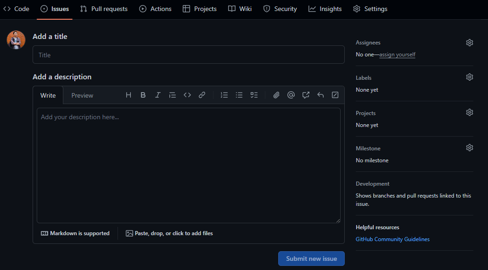

How to Report an Issue
#######################

This document is a template for reporting issues or bugs that exist in the code, everyone needs to report any errors they find when running the program and ask the maintainer to solve them. Write the title of the issue that you found, along with the date. Also, write your name as the reporter, and make a detailed description of the problem. If possible, write the reference of the error code, such as which function has an error or what features you'd like to add. Here is the template:

   Adding issue in moilapp github repository

**1. Title issue**

create a good title that people really understand about your issue.

*ex: Anto-recording-screen-problem-2023-07-20*

**2. Problems**

Describe your issue such as **what happen**, **what kind of condition** and **what the effect** of the error.

**3. References of your problem**

- You can write the line number of code or position of error
- Add photo and sort video in folder issue
- If photo and video to big please read note

*Note:*

- If photo and video is too big. You can upload photo and video in Onedrive in `this link <BL94_>`_.
- Please create the folder under your name for every bug found.
- If any issue, please contact the maintainer.

.. _BL94: https://mcut-my.sharepoint.com/:f:/g/personal/oilmcut_o365_mcut_edu_tw/EtPsKQ8sOQ1OsfzzNIqaKM8B61p_yWgQ_xEt1PH51UDOjA?e=Oge2qw