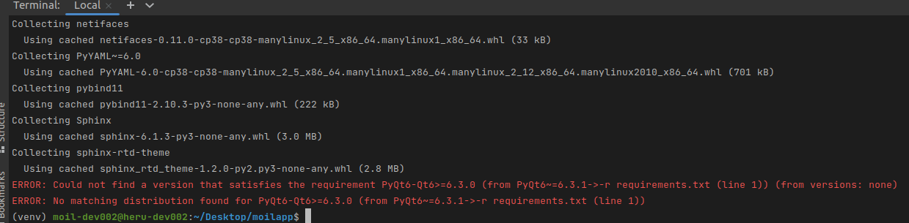
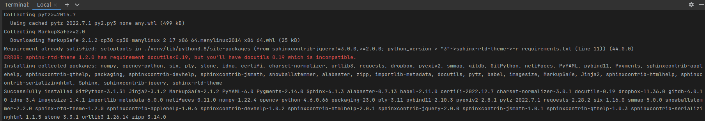
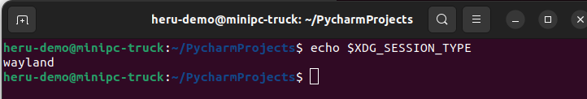
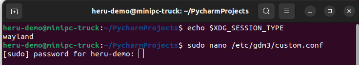
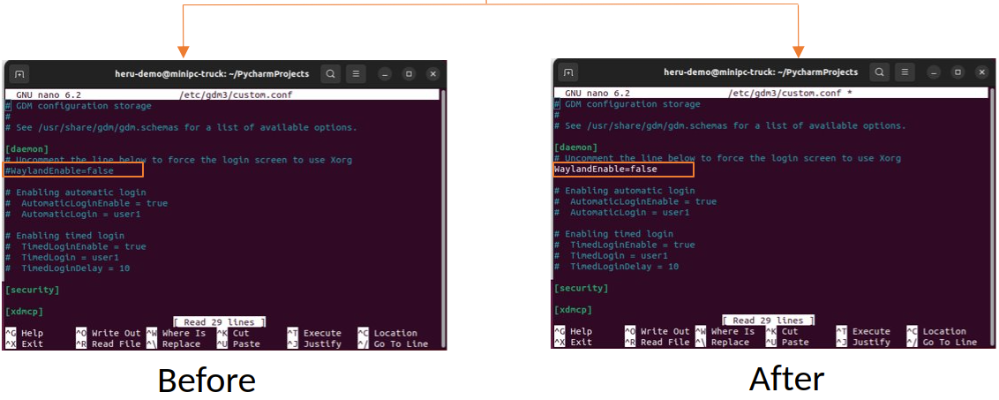
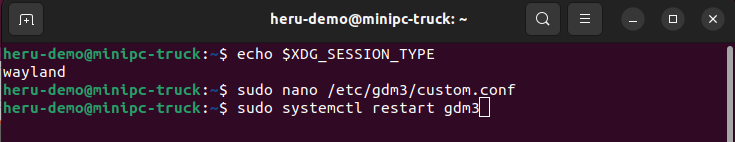
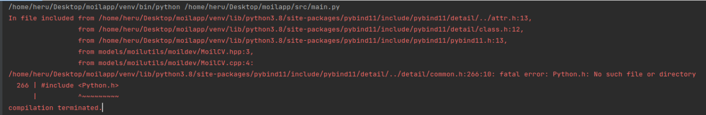
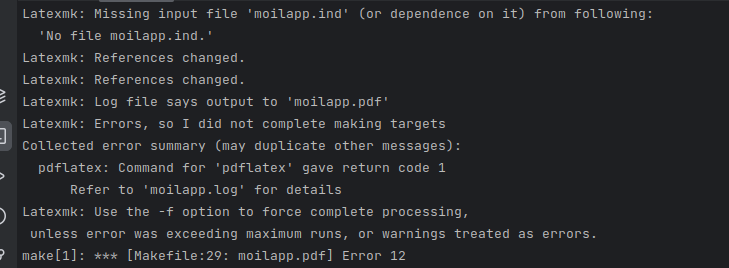
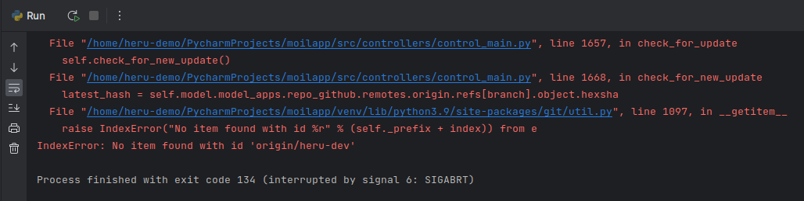

Troubleshooting Problems
########################

.. raw:: html

   

    When using any application, it's possible to encounter issues or problems that can prevent it from functioning as intended.
    These issues may range from minor annoyances to major bugs that significantly impact the user experience.
    As a user of the application, it's important to report these issues to the developers so that they can address and get it fixed.  

    Overall, reporting issues is a crucial part of the software development process, and it helps to ensure that the applications are reliable,
    functional and user-friendly. Few issues are listed below.

Application Installation
========================

.. raw:: html

   

    If you encounter problems with some the libraries <i>(requirements.txt)</i>, such as a few libraries that cannot be installed on
    the computer, as shown in the image below.

   PyQt6 cannot installation

   Sphinx-rtd-theme incompatible (Theme)

.. raw:: html

   

    We recommend creating a specific <i>virtual environment</i> for no errors to occur when users try to install the library. As follows.

.. code-block:: console

   $ sudo apt-get install python3.9-venv​

   $ python3.9 -m venv venv​

   $ source venv/bin/activate​

.. code-block:: console

    $ pip --version

Screen Recording on Application
--------------------------------

.. raw:: html

   

    The difficulty in using MoilApp's screen recording functions is that the captured video can only be seen as a black screen and cannot be played back due to the type system protocol. You can, however, fix this by following the instructions below.

   Wayland type screen

Command to check the of type security screen

.. code-block:: console

   $ echo $XDG_SESSION_TYPE

   open configuration

Command to open custom configuration

.. code-block:: console

   $ sudo nano /etc/gdm3/custom.config

   Change to waylandEnable=False

   Restart your computer

Command for restart your computer

.. code-block:: console

   $ sudo systemctl restart gdm3

.. raw:: html

   

    The last way is if the condition has been on <i>x11</i> type, however, the program still cannot be running, may you should be
    typing command on your terminal to fix it.

.. code-block:: console

   $ sudo apt install libxcb-cursor0

Python.h Missing on Python-dev
-------------------------------

.. raw:: html

   

    If you encounter installation problem with <i>pybind</i> while using MoilCV, you can install <i>python-dev</i> that is compatible
    with your Python version to resolve the issue. The steps to take are the instructions provided below.

.. code-block:: console

   $ sudo apt-get install python3.8-dev

or

.. code-block:: console

   $ sudo apt-get install python3.9-dev

   Python-dev installed based on version

Sphinx Documentation for PDF
-----------------------------

.. raw:: html

   

    Difficulty in accessing the <i>MoilApp documentation</i> in PDF format is a common issue encountered by users. This is often
    caused by errors that occur during the initial conversion of the documentation to HTML. To resolve this issue. Please
    endure that you follow the instructions carefully.

   Convert rst file to html file

If the following error occurs, we advise installing an additional library so that it can be converted properly.

Command for install library

.. code-block:: console

   $ sudo apt install latexmk

   $ sudo apt install textlive-latex-extra

The command below can be typed in the terminal to access the documentation.

Command for generate file

.. code-block:: console

   $ make html

   $ make latexpdf

.. raw:: html

   

    This command is employed for deleting a documentation file, and it is also beneficial when updating a modified file.
    If the previous file is not deleted, the documentation will still show the outdated file instead of the updated version.

.. code-block:: console

   $ make clean

Application running
--------------------

.. raw:: html

   

    You cannot update the application when an update notification is present when you establish a new branch and add some functions, or alter the source code, you will encounter an error and a dump if you try this.

   check for update on local branch

.. raw:: html

   

    To update your branch, you can use this command in case you encounter an error. This command will ensure that
    any changes made are saved locally.

.. code-block:: console

   $ git stash save "Save comment in local computer"

And then, try do change another branch again.

.. code-block:: console

   $ git checkout "develop/main"

Adjustment of name your branch want to change

References
===========

    - `Specific python | How to install pip for Python 3.9 <https://stackoverflow.com/questions/65644782/how-to-install-pip-for-python-3-9-on-ubuntu-20-04>`_

    - `Python.h missing on | with python-dev installed <https://stackoverflow.com/questions/65743603/python-h-missing-on-ubuntu-18-with-python-dev-installed>`_

    - `Ubuntu > 20.04, | XCB type screen display <https://intellij-support.jetbrains.com/hc/en-us/community/posts/11003640644242-Ubuntu-20-04-xcb?page=1#community_comment_11048699939346>`_
