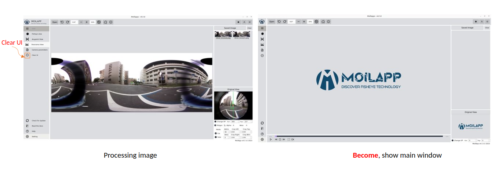

MoilApp of Usage
#############

.. raw:: html

   

    In this section, we will explain the components of the MoilApp application and provide tutorials on how to use the application. <b><u>MoilApp</u></b> is a software application that users can utilize, and the referred session might be some kind of training session where the instructor will provide an overview of the various parts of the application and teach users how to use them effectively.

.. figure:: assets/user-operation.png
   :scale: 65 %
   :alt: Operations of the MoilApp
   :align: center

   Operations of the MoilApp

Overview of Apps
==============

.. raw:: html

   

   "MoilApp software application" when it is running for the first time, specifically, the application will display a <b><i>splash</i></b> screen to the user, which is a graphical image or animation that indicates that the application is loading and that will be available soon. This splash screen is a new feature that has been added to the latest version of MoilApp (version 4.1). 

.. figure:: assets/21.splash-screen.png
   :scale: 75 %
   :alt: Splash Screen Application
   :align: center

   Loading Splash screen Application

.. raw:: html

   

    When you open a project in PyCharm, the user interface will show the default main window, ready to run, looks as follows:

.. figure:: assets/1.overview-user.png
   :scale: 70 %
   :alt: alternate text
   :align: center

   Main window MoilApp

1. Open media source
--------------------

.. raw:: html

   

    The inputs offered by MoilApp include picture files, video files, and cameras—USB cameras, web cameras,
    and streaming cameras from Raspberry Pi—all of which can be used for processing. Simply tap the appropriate button
    for the media source you want to process, and the software will open a file explorer popup, similar to the one below.

.. figure:: assets/2.open-image.png
   :scale: 70 %
   :alt: open media source
   :align: center

   Open Media Source

.. figure:: assets/3.select-media-source.png
   :scale: 65 %
   :alt: Select Media Source
   :align: center

   Select Media Source

.. raw:: html

   

    - After selecting the file to open, a combo box prompt will appear asking you to select the type of camera that
    was used. The camera parameters can be loaded from the database using this.

.. raw:: html

   

    - There are two ways to open the camera: through USB or via streaming. You can use the combo box to pick the USB port
    that is being used for a camera, click <b>OK</b>. And then, you will be prompted to select the type of camera that is being used.
    As depicted in the picture below.

.. raw:: html

   

    - The streaming camera option allows you to access the raspberry-pi camera using the stream server URL. You merely need
    to enter the camera's URL and click <b><i>"OK"</i></b> button, as seen below. In the combo box prompt,
    you will be prompted to select the type of camera being utilized.

2. Rotate Image
----------------

.. raw:: html

   

    MoilApp has two rotate functions: rotate the left image and rotate the right image. Rotation can be operated
    by entering a value on the rotate scale, this helps the user to rotate with a lesser scale.

   Processing Rotate left & Rotate right Image

3. Zoom Image
-------------

.. raw:: html

   

    The user can zoom in and out using the <i>plus</i> and <i>minus</i> buttons, respectively, in this program. In addition,
    the user can select the zoom scale to be smaller by a minimum of <i>25 degrees</i> and above to make the final image.

.. figure:: assets/5.zoom-image.png
   :scale: 65%
   :alt: Zoom in and out of the images
   :align: center

   Processing Zoom in & Zoom out Image

4. Default Application
-----------------------

.. raw:: html

   

    The application will automatically return to the original image when the default button is clicked. When the user is processing an image, for instance, when the user is processing an image to any point and then decides they want to go back to the original image, this position is the position when the user loaded the image when opening the application.

   Processing default image to original

5. Add Plugin Applications
---------------------------

.. raw:: html

   

    When the user wants to create an application integrated with MoilApp or the user wants to open the application,
    the user can add the application to MoilApps by clicking the Add button at the top of the application,
    provided that the user creates the application using MoilDev or MoilUtils-Templates.

   Add application

6. Information Applications
---------------------------

.. raw:: html

   

    The users can view related information on MoilApp by accessing further information.

.. figure:: assets/8.information-apps.png
   :scale: 70%
   :alt: Notice Info
   :align: center

   Notice Application

7. Recording Screen
--------------------

.. raw:: html

   

    A new feature offered by MoilApp is screen recording, which makes it simpler for users to do so.
    This tool is also a helpful way to record and share videos of what is happening on your desktop.

.. raw:: html

   

    When using a desktop application to record your screen, you'll typically have a few options to choose from.
    First, you'll need to select the area of your screen that you want to record. Some applications allow you to record
    your desktop, while others let you record region of your screen.

8. About US
------------

.. raw:: html

   

    The application "About Us" section contains details about our work in the field of fisheye image processing.

   Information About US

9. Theme Application
--------------------

.. raw:: html

   

    In order to assist users adjust to their eyes and avoid seeming monotonous while using this software,
    MoilApp offers two themes for use: one in bright mode and the other in dark mode.

.. figure:: assets/11.theme-apps.png
   :scale: 55 %
   :alt: alternate text
   :align: center

   Light theme & Dark Theme application

10. Hide Button Application
---------------------------

.. raw:: html

   

    By using the <b>ESC</b> key on the keyboard, users can also conceal or reveal the title of the button or
    view the button's functionality in the application.

.. figure:: assets/12.hide-apps.png
   :scale: 80 %
   :alt: Show or Hide Button in App
   :align: center

   Show/Hide button application

11. Fisheye View
-----------------

.. raw:: html

   

    The user interface will display the <b>Anypoint image</b> or <b>Panorama image</b> as shown below when the user chooses to process
    the original fisheye image by using the <b>Anypoint</b> or <b>Panorama</b> button on the user interface.

   Show Image from Directory Computer

.. raw:: html

   

    We offer controls for video and camera media, including play, pause, stop, forward, backward, and a slider timer.
    Where image processing can be facilitated by the use of this controller.

12. Anypoint View
------------------

.. raw:: html

   

    Sometimes we only want to look at places where there is a lot of information in order to improve the outcomes of observations.
    As a result, we can apply the approach of  undistortion rectilinear selected image. This approach shifts the
    optical axis to the specified <b>zenithal (alpha)</b> and <b>azimuthal (beta)</b> angles, then converts the image plane coordinate
    to hemispherical coordinates.

    Anypoint view has two modes, with mode 1 being the result of alphaOffset degree rotation followed by betaOffset degree
    rotation around the Z-axis (roll) (pitch). In contrast, mode-2 produces a thetaY degree rotation around the Y axis (yaw)
    following a thetaX degree rotation around the X axis (pitch).

.. figure:: assets/14.anypoint-image.png
   :scale: 75%
   :alt: Anypoint Image
   :align: center

   Processing Anypoint Image

.. raw:: html

   

    You can switch from <b>mode 1 to mode 2</b> or vice versa by pressing the help button when in Anypoint view mode.
    The help button can also be used to view Anypoint results coming from a certain angle. An overview of the additional
    button in Anypoint view mode may be found below.

13. Panorama view
------------------

.. raw:: html

   

    As explained earlier, the panorama view may present a horizontal view in a specific immersed environment to meet
     human visual perception. The figure below shows a diagram of transforming a fisheye image into a panoramic view.

.. figure:: assets/diagram.jpg
   :scale: 100 %
   :alt: transformation image of panoroma view
   :align: center

   Diagram processing Original View to Panorama View

The image below is the result of image processing panorama view.

   Processing Panorama View

.. raw:: html

   

    - The maximum and minimum FoV values can also be changed using the lineedit feature, which is only available in this mode.

.. raw:: html

   

    - By clicking the save image button or selecting save image from the context menu when you right-click on the
      result image, you can save the original image or the result image. When you save an image for the first time,
      the application will open a dialog box asking you to select the directory you want to utilize as storage.

.. raw:: html

   

    - Use the record button to start recording a video, it works almost just like storing an image.You will be asked
      to select a directory before you can begin recording, and the video files will be saved there.

14. Camera parameters
---------------------

.. raw:: html

   

    The camera parameter is a very important component in fisheye image processing. Each fisheye camera can be calibrated.
    and derive a set of parameters by the <b>MOIL laboratory</b> before the successive functions can work correctly,
    configuration is necessary at the beginning of the program. MoilApp provides a form dialog that can add, modify,
    and delete parameters that will be stored in the database. To be able to use this feature,
    please click on File–>Camera Parameters.  The overview of this form is shown in the picture below: 

   Camera Parameters

.. raw:: html

   

    - If you want to see the parameter, you can list the camera type from comboBox list parameter
        If you are using a camera whose parameters are not yet available in the database, you can add them. You just need to
        write all the parameters on the form, then click the<b> new </b>button. After that the data will be saved and you can use
        the camera parameters.

.. raw:: html

   

    - Modify camera parameters

        If you want to change the value of the parameter, you can modify it. select the camera type in the list parameter
        combobox, then you enter the new parameter value. click the update button and the modified parameters will be saved
        in the database.

.. raw:: html

   

    - You can also delete parameters by clicking the delete button on the selected parameter list.

15. Clear User Interface (UI)
-----------------------------

.. raw:: html

   

    Clear UI is the latest feature in MoilApp. This feature is used to clean images on the user interface,
    Usually, if you don't use Clear UI, when the user opens the application again, the user is faced with the previous
    task when processing images, therefore, this feature is used to clear data on the user interface.

   Clear data in the application

16. Check for Updates
----------------------

.. raw:: html

   

    Checking for updates is an additional feature of the MoilApp update, this feature is used if the user wants to
    update the application from the developer server. The use of this feature greatly facilitates the user without
    having to open a terminal to do the installation or update manually.

   Check updating application from main server

17. Read the Docs Application
------------------------------

.. raw:: html

   

   The <b>Read the Docs</b> feature makes it simple for users to open documents without having to launch a terminal and create HTML files from RST files. By simply clicking on this feature, the application will automatically create a document and display it in the user's browser. <b>Read the Docs</b> is the application documentation that aids users in understanding every feature of MoilApp..

   Generate documents to html

18. Help Information
---------------------

.. raw:: html

   

    The help information in the desktop application refers to a user guide or set of instructions that provide
    guidance on how to use the MoilApp plugin software effectively. This information can be accessed in a number of ways,
    including through menus or a dedicated Help button within the app.

19. Application Settings
-----------------

.. raw:: html

   

    Additionally, by providing information on the update history of each commit made by the developer when
    the application is updated, users can stay informed about changes to the application and have a better understanding
    of how the application works. Overall, the application settings are a crucial component of any modern application,
    and they play a vital role in providing users with a rich and personalized experience.

   Generate documents to html

Mouse Event
===========

.. raw:: html

   

    There are several functions of the mouse event that you can use to speed up work. The mouse event will only work on
    the result image and the original image of the user interface widget. Some of the mouse event functions are included. 

Mouse click event
-----------------

.. raw:: html

   

    When in Anypoint mode, the mouse click event only functions on the original picture widget. The coordinates of
    the points whose alpha-beta value will be transformed can be easily determined using this. which means that when
    converting the original image to an Anypoint image, this value will be a parameter.

Mouse click-move event
-----------------------

.. raw:: html

   

    The mouse-click event has its own function in each image widget; in the original image, this widget works in Anypoint mode, which allows for surrounding views. If you press the press-move mouse event on the resultant image widget, different functions are available. You can enlarge the area in which you are interested using this function, and it works in all-mode view, as in the example shown in the image below.

Double click event
------------------

The Double click mouse event has function to reset Anypoint view to default in Anypoint mode.

Right click event
-----------------

If you right click on the mouse, it will display menu options like maximize, minimize, save image and show info.

Mouse wheel
-----------

    <b>Wheel event</b> will work by pressing the ctrl key simultaneously to zoom in and zoom out images on the user interface display.

Keyboard Shortcut
=========================

.. raw:: html

   

    The majority of MoilApp's processing- and other-related commands have keyboard shortcuts. By keeping your hands on
    the keyboard and increasing your productivity, learning these hotkeys might be helpful. Some of the most beneficial
    shortcuts to learn are listed in the following table:

.. figure:: assets/shortcut.jpg
   :scale: 75%
   :alt: Shortcuts Image
   :align: center

   Shortcut application

