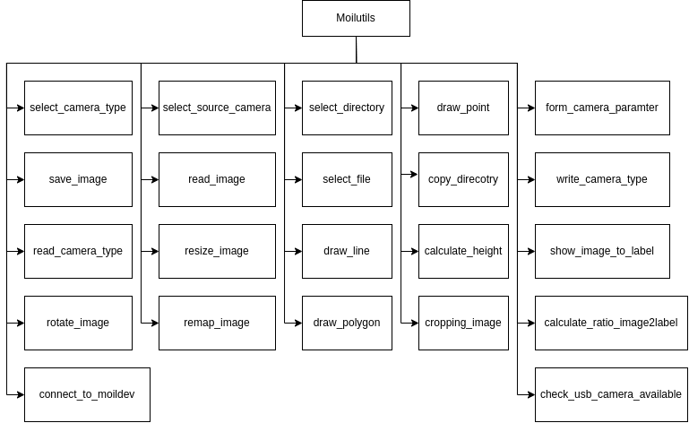
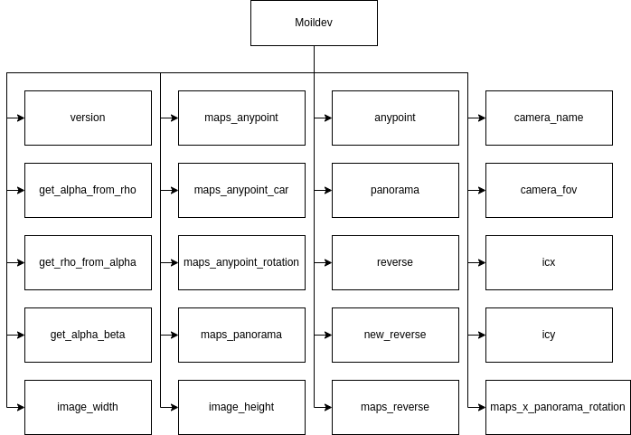

API Reference
##############

Moilutils package
==================

Moilutils is a package that containing several modules that has utilization functions for helping to simplify the
process of developing apps. bellow is the function name:

|

.. automodule:: moilutils.moilutils
   :members:
   :undoc-members:
   :show-inheritance:

Moildev package
================
Moildev Library is a collection of functions to developments fisheye image applications.
Initially, this library is written for C++ programing language. In the recent decade, python is
a programming language that is very popular for developers. That is the reason why we are developing
the Moildev library for python.

|

.. automodule:: moilutils.Moildev.Moildev
   :members:
   :undoc-members:
   :show-inheritance:

