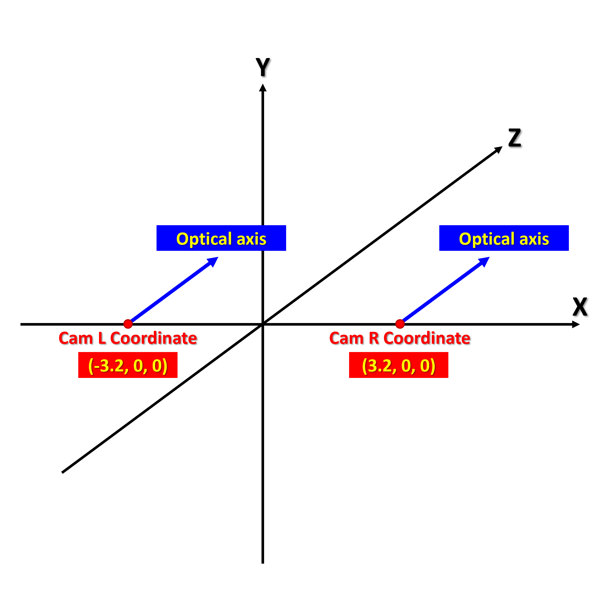

# moil_3d_algorithm

## Part1. Requirement 
### Tested:
- Ubuntu > 20.04
- Python > 3.8
- opencv-python > 4.5.3.56
- sympy > 1.11.1

```commandline
$ pip install moildev
```
```commandline
$ pip install sympy
```


## Part2. Tutorial
```python
import Moildev
from moil_3d import Moil3dAlgorithm

left_cam_param = './intel_t265_c_left_848x800_20220914_848x800_yuanman_andy_hwan.json'
right_cam_param = './intel_t265_c_right_848x800_20220906_848x800_yuanman_andy_heru.json'

left_cam_moildev = Moildev.Moildev(left_cam_param)
right_cam_moildev = Moildev.Moildev(right_cam_param)
```



```python
left_cam_p1 = (336, 70)
left_cam_p2 = (674, 131)
```

```python
right_cam_p1 = (183, 141)
right_cam_p2 = (519, 74)
```


### Calculate Distance
**[ Note ]**
- This example is measure 3d distance with 2 parallel camera.
- If 2 camera is face to face, the argument "face2face" should be "True"
```python
distance = Moil3dAlgorithm.measure_3d_distance(left_cam_moildev, right_cam_moildev,
                                               left_cam_p1, left_cam_p2,
                                               right_cam_p1, right_cam_p2,
                                               camera_distance=6.4,
                                               face2face=False)
print(distance)
```
```python
12.13
```